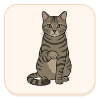
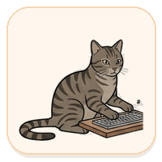
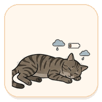
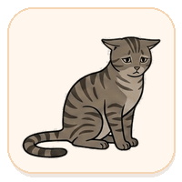
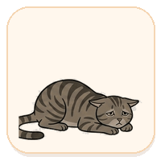

<div align="center">

# 🐱 ClaudeCat

**A hand-drawn cat that lives on your desktop and shows your [Claude Code](https://claude.com/claude-code) usage in real time.**

The cat sits transparent and frameless in the corner of your screen. The more of your
budget you've burned, the more tired it looks — and when Claude Code is busy working, the
cat starts typing along with it.

[](LICENSE)


  

</div>

---

## What it does

ClaudeCat reads **your own** Claude Code usage and turns it into a mood. There's no separate
login — it uses whatever account Claude Code is already signed into. Under the cat sits a
slim **5-hour** fuel gauge with a live reset countdown; **hover** the cat to peek at your
**weekly** budget as a row of little hearts.

The cat's pose tracks whichever budget is tighter — `load = max(5h%, weekly%)`:

<table>
<thead>
<tr><th>Cat</th><th>When</th><th>Mood</th></tr>
</thead>
<tbody>
<tr>
<td align="center"></td>
<td>Plenty of headroom — <b>load &lt; 90%</b></td>
<td><b>Relaxed.</b> Sits and grooms itself on a lazy loop.</td>
</tr>
<tr>
<td align="center"></td>
<td>Getting low — <b>load ≥ 90%</b></td>
<td><b>Tired.</b> Sitting up, droopy-eyed.</td>
</tr>
<tr>
<td align="center"></td>
<td>Right at the edge — <b>load ≥ 97%</b></td>
<td><b>Weary.</b> Lying low, worn out.</td>
</tr>
<tr>
<td align="center"></td>
<td>Rate-limited — <b>load ≥ 99.5%</b></td>
<td><b>Asleep.</b> Curled up, with a soft <code>Reset in 02:40</code> breathing beside it.</td>
</tr>
<tr>
<td align="center"></td>
<td>A task is running <i>(any budget)</i></td>
<td><b>Typing.</b> Paws at the keyboard while Claude Code works, then settles back.</td>
</tr>
</tbody>
</table>

The **typing** pose is an overlay: while a task is in progress ClaudeCat plays the working
animation (unless the cat is fully rate-limited — an asleep cat stays asleep). Detection is
**exact** — Claude Code `UserPromptSubmit` / `Stop` hooks (installed alongside the statusline
hook) flip a flag on when a turn starts and off when it ends, so the cat keeps typing through
long generations and multi-minute tool runs. Without those hooks it falls back to a coarser
transcript-activity heuristic.

## Interacting with the cat

| Action | What happens |
| --- | --- |
| **Hover** | Reveals the weekly hearts; they slip away when your pointer leaves. |
| **Drag** | Moves the cat anywhere — it stays put where you drop it. |
| **Right-click** | Opens the pet menu: animation speed, cat size (zoom), reset position, hide, quit. |
| **Tray icon** | Show/hide, install statusline hook, reset position, toggle click-through, start on login, quit. |

"Click-through" lets mouse clicks pass through the widget to the desktop behind it. All
settings (size, animation speed) persist across restarts, and the app can start on login.

## Install

> ClaudeCat currently ships for **Windows**.

**Option A — installer.** Download `ClaudeCat_x.y.z_x64-setup.exe` (or the `.msi`) from
[Releases](https://github.com/QiyuZ/ClaudeCat/releases) and run it.

**Option B — PowerShell.** Fetch and launch the latest installer in one go:

```powershell
$a = (irm https://api.github.com/repos/QiyuZ/ClaudeCat/releases/latest).assets |
  Where-Object name -like '*x64-setup.exe' | Select-Object -First 1
$o = Join-Path $env:TEMP $a.name
Invoke-RestMethod $a.browser_download_url -OutFile $o; Start-Process $o
```

Then:

1. The cat appears in the top-right corner and wakes up on its own within a minute (as long
   as you're signed into Claude Code).
2. *(Recommended)* Click **Connect ClaudeCat** — or tray → *Install statusline hook* — to add
   the statusline data source (see [Where the numbers come from](#where-the-numbers-come-from)).
   ClaudeCat won't overwrite a custom `statusLine` you already keep.

### Launching it later

- **Start on login (recommended):** right-click the tray icon → **Start on login**. The cat
  then shows up automatically every time you sign in — no need to launch it by hand.
- **From a terminal:** add a `claudecat` command to your PowerShell profile (`notepad $PROFILE`):

  ```powershell
  function claudecat { Start-Process "$env:LOCALAPPDATA\claudecat\claudecat.exe" }
  ```

  Point the path at wherever the installer placed `claudecat.exe` (tray or Start-menu shortcut
  → *Open file location*). Then just run `claudecat` from any terminal.

Right-click the cat for per-pet options; use the tray icon for the rest.

## Where the numbers come from

ClaudeCat never asks you to log in and never scrapes the web. It reads your usage from up to
**two local sources**, preferring whichever has fresh, real data:

**1. The statusline hook (preferred).** Claude Code renders a *statusline* on each turn and
hands the script an official `rate_limits` payload — exact 5-hour and weekly percentages with
reset times. ClaudeCat installs a tiny hook (`scripts/statusline.js`) that caches this to
`~/.claude/cc-pet-usage.json`. This payload only appears for **Pro/Max** accounts and only
**after the first API response** in a session, so the hook carries forward the last-known
values between responses (up to 3 hours, after which stale data is dropped rather than shown).

**2. The OAuth usage endpoint (fallback).** Some Claude Code versions don't emit `rate_limits`
to the statusline at all. When the hook isn't delivering fresh data, ClaudeCat falls back to
the same endpoint Claude Code's own `/usage` command uses — see [Privacy & security](#privacy--security)
for exactly what this reads and sends.

Either way, the numbers are exactly what Claude Code itself reports, for whatever account
it's signed into.

> **You don't need to run `claude` to see your usage.** As long as you've signed into Claude
> Code at least once (so its credentials exist), the OAuth fallback fetches your usage on its
> own the moment the widget launches. Running a Claude Code session only refreshes the
> statusline path and drives the cat's typing pose.

## Privacy & security

ClaudeCat is a local desktop widget. Here is **everything** it touches — all of it auditable
in this repo:

- **No separate login, no telemetry, no analytics.** ClaudeCat has no backend of its own and
  phones no home.
- **Files it reads:**
  - `~/.claude/cc-pet-usage.json` — the cache written by its own statusline hook.
  - `~/.claude/.credentials.json` — **only** for the OAuth fallback, to read the access token
    Claude Code already maintains. ClaudeCat never copies, logs, or transmits this token
    anywhere except the request below.
  - modification **timestamps** (not contents) of transcript files under `~/.claude/projects`
    — this is how it knows a task is in progress and plays the typing animation.
- **What it writes (opt-in, when you click Connect):** a statusline hook and two activity
  hooks (`UserPromptSubmit` / `Stop`) in `~/.claude/settings.json`, plus their small scripts
  in `~/.claude/cc-pet/`. It backs up your `settings.json` first, refuses to replace a custom
  `statusLine`, and merges the activity hooks alongside any hooks you already have.
- **The one network call it makes:** a `GET` to `https://api.anthropic.com/api/oauth/usage`
  (Anthropic's official server) with your token, to read your own usage — the same call Claude
  Code makes internally. The response is normalized to percentages + reset times and cached to
  `~/.claude/cc-pet-usage-oauth.json`; **no token is stored on disk**.
- **Undocumented-endpoint caveat:** `/api/oauth/usage` is not a documented public API and
  could change without notice. If it does, ClaudeCat simply falls back to the statusline path.
- **Debugging is opt-in:** the hook only writes a raw-payload dump (`~/.claude/cc-pet-debug.json`)
  when you set `CC_PET_DEBUG=1`.

If you'd rather not use the OAuth fallback at all, you can run statusline-only — open an issue
and it's a small change to gate it off.

## Build from source

Requires **Node** and the **Rust MSVC toolchain** (Rust + Visual Studio C++ Build Tools) for
Tauri v2.

```powershell
npm install
npm run tauri dev     # dev run with hot reload (first compile takes a few minutes)
npm run tauri build   # -> .msi / .exe in src-tauri/target/release/bundle
```

### Manual statusline setup

If you keep your own statusline, chain ClaudeCat as a pass-through — the hook prints a short
`🐱 5h .. · wk .. left` line — or point `settings.json` directly at the bundled script:

```jsonc
// ~/.claude/settings.json
{
  "statusLine": { "type": "command", "command": "node \"C:\\Users\\<you>\\.claude\\cc-pet\\statusline.js\"" }
}
```

## How it works

```
Claude Code ──▶ statusline hook ──▶ cc-pet-usage.json ─┐
                                                       ├─▶ Rust core (merge + poll 3s) ──▶ React UI
OAuth /usage ──────────────────▶ cc-pet-usage-oauth.json ┘        │
transcript mtimes ───────────────────────────────────────────────┘  (task-active → typing)
```

| File | Responsibility |
| --- | --- |
| [`src/pet/stateMachine.ts`](src/pet/stateMachine.ts) | Turns usage % into a mood (`load = max(5h, weekly)`) and the reset-countdown helpers. |
| [`src/characters/cat.tsx`](src/characters/cat.tsx) | The only file that knows what the animal looks like: maps each mood to sprite frames (relaxed grooming loop, endless typing loop). Swap it to add a dog. |
| [`src/components/QuotaGauge.tsx`](src/components/QuotaGauge.tsx) | The 5-hour fuel gauge (paw + glossy pill) and reset countdown. |
| [`src/components/WeeklyHearts.tsx`](src/components/WeeklyHearts.tsx) | The weekly budget as a hover-revealed heart health-bar. |
| [`src/components/PetMenu.tsx`](src/components/PetMenu.tsx) | The right-click menu (animation, size, actions). |
| [`src/pet/useUsage.ts`](src/pet/useUsage.ts) | Subscribes to the Rust core; distinguishes "no data" from a real 0%. |
| [`src/App.tsx`](src/App.tsx) | Composition, onboarding, drag / hover / menu, and window sizing. |
| [`scripts/statusline.js`](scripts/statusline.js) | The Claude Code statusline hook that caches `rate_limits`. |
| [`src-tauri/src/lib.rs`](src-tauri/src/lib.rs) | The transparent always-on-top window, tray, autostart, the two data sources (cache merge + OAuth fallback), task-activity detection, and the hook installer. |

### Sprite pipeline

The art is sliced from four hand-drawn strips in `src/pic/` into transparent per-frame PNGs:

```powershell
pip install Pillow numpy scipy
python scripts/process_sprites.py    # src/pic/*.png -> src/assets/cat/*.png
python scripts/make_state_gifs.py    # src/assets/cat/*.png -> docs/*.gif (README art)
```

## Roadmap

- ✅ Transparent sprite cat with real 5h / weekly data, robust reset countdowns.
- ✅ OAuth usage fallback for Claude Code versions that don't emit `rate_limits`.
- ✅ Hover-reveal weekly hearts; "actively working" typing pose from live task detection.
- ⬜ Optional dog (or other) character; weekly heat-map; macOS / Linux builds.

## Credits & license

Built with [Tauri v2](https://tauri.app) + React + TypeScript. Cat art hand-drawn for this
project. Data-layer inspiration from [`ohugonnot/claude-code-statusline`](https://github.com/ohugonnot/claude-code-statusline)
and [`ccusage`](https://github.com/ryoppippi/ccusage).

Released under the [MIT License](LICENSE) © 2026 QiyuZ.
