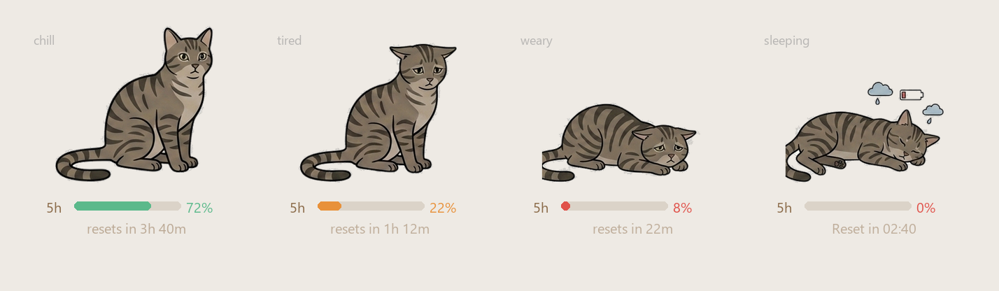

# 🐱 ClaudeCat

A tiny hand-drawn cat that lives in the top-right corner of your desktop and shows your
**Claude Code** usage. The cat is transparent, frameless and draggable — the busier your
5-hour budget gets, the more tired the cat looks:

| Load (of the fuller window) | Cat |
| --- | --- |
| plenty of headroom | 🧘 relaxed, grooming itself |
| getting low (≥ 70%) | 😔 sitting, droopy-eyed |
| almost out (≥ 90%) | 😩 lying down, worn out |
| rate-limited (100%) | 😴 curled up asleep, with a faint **`Reset in 02:40`** breathing beside it |

Under the cat is a slim **5-hour fuel gauge** with a soft reset countdown. Click the cat for a
detail panel (5h bar + weekly hearts + a "copy status" button).



## Where the numbers come from

ClaudeCat reads **your own** Claude Code usage — it does not ask you to log in again and it
does not scrape anything. Claude Code renders a *statusline* on every turn and hands the
script the official `rate_limits` payload (exact 5-hour + weekly percentages and reset
times). ClaudeCat installs a small statusline hook that caches that payload to
`~/.claude/cc-pet-usage.json`; the widget polls the cache. So the numbers are exactly what
Claude Code itself reports, for whatever account Claude Code is already signed into. Zero
extra auth, and it works for any user who installs the app.

## Install (end users)

1. Download and run the installer (`ClaudeCat_x.y.z_x64.msi`) from Releases.
2. The cat appears top-right showing **"Waiting for Claude Code…"**. Click **Connect
   ClaudeCat** (or the tray icon → *Install statusline hook*). This registers the hook in
   `~/.claude/settings.json`. If you already have a custom `statusLine`, ClaudeCat refuses to
   overwrite it — see [Manual setup](#manual-setup).
3. Run any Claude Code session. Within a few seconds the cat wakes up with live data.

Tray menu: show/hide, install hook, reset position (back to top-right), toggle click-through
(let clicks pass through to the desktop), quit. The app can start on login.

### Manual setup

If you keep your own statusline, add ClaudeCat as a pass-through instead. The hook prints a
short `🐱 5h .. · wk .. left` line, so you can chain it, or point `settings.json` at the
bundled script:

```jsonc
// ~/.claude/settings.json
{
  "statusLine": { "type": "command", "command": "node \"C:\\Users\\<you>\\.claude\\cc-pet\\statusline.js\"" }
}
```

Set the env var `CC_PET_DEBUG=1` to also dump the raw statusline stdin to
`~/.claude/cc-pet-debug.json` — handy if a Claude Code version renames the `rate_limits`
fields.

## Develop

Requires Node and the Rust MSVC toolchain (Rust + VS C++ Build Tools) for Tauri v2.

```powershell
npm install
npm run tauri dev     # dev run (first compile takes a few minutes)
npm run tauri build   # produce .msi / .exe in src-tauri/target/release/bundle
```

The cat art is sliced from the four hand-drawn strips in `src/pic/` by a one-off script that
knocks out the white background, auto-detects the frames and trims them to transparent PNGs:

```powershell
pip install Pillow numpy scipy
python scripts/process_sprites.py   # -> src/assets/cat/*.png
python scripts/preview_widget.py    # -> preview.png (optional layout check)
```

## How it works

- `src/pet/stateMachine.ts` — turns usage % into a mood (`load = max(5h, weekly)`).
- `src/characters/cat.tsx` — the only file that knows what the character looks like: maps
  each mood to sprite frames (a multi-frame mood loops as a cheap idle animation). Swap this
  to add a dog later.
- `src/components/QuotaGauge.tsx` — the 5-hour gauge + breathing reset line under the cat.
- `src/components/ExpandPanel.tsx` — the click-to-expand detail drawer.
- `src/App.tsx` — composition + first-run onboarding; asks Rust to resize the transparent
  window to fit each layout (cat / setup / panel) so empty area never eats desktop clicks.
- `scripts/statusline.js` — the Claude Code statusline hook that caches `rate_limits`.
- `src-tauri/src/lib.rs` — transparent, frameless, always-on-top, no-taskbar window;
  top-right positioning; tray menu; click-through; autostart; usage-cache polling; and the
  hook installer (which will not clobber a foreign `statusLine`).

## Roadmap

- **V1 (this)** — transparent sprite cat, real 5h/weekly data via statusline, reset
  countdown, onboarding, MSI packaging.
- **Next** — "actively working" pose from JSONL activity (the typing-cat frames are already
  sliced and waiting); settings panel; weekly heat-map; optional dog character.
